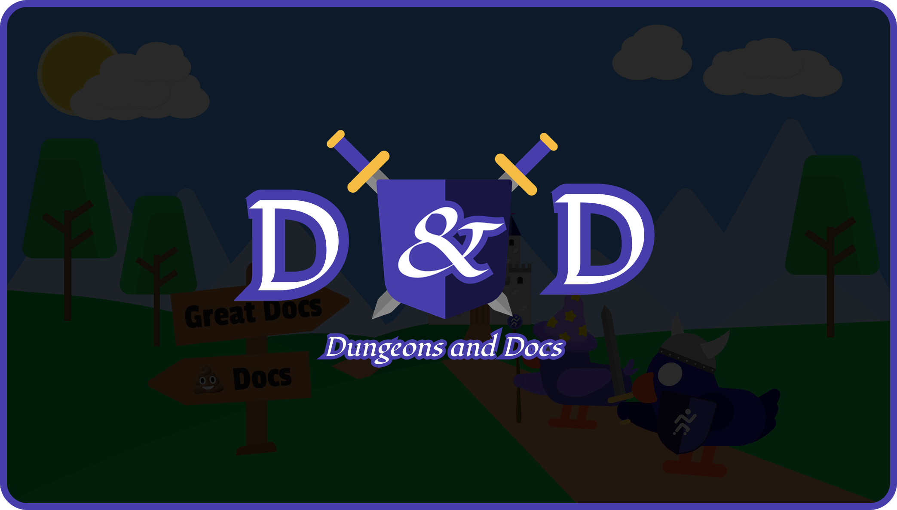

    

        
    

    

# Dungeons and Docs

Welcome to Joggr's battle tested documentation templates that you can use to set up your perfect documentation. This repository will help you on your quest for the Golden Codex of Perfect Documentation (aka a great docs setup). 

You might ask: "How can these templates help me on my quest?"

- 📝 **Easy to Use**: These templates are designed to be easy to use and customize for your team
- 🚀 **Ready to Go**: All of our templates are battle-tested at the largest of enterprises & fastest of startups
- 🧳 **Portable**: Since the templates are in markdown they can be imported anywhere that supports markdown (basically everywhere)
- 🧙 **Wizard Approved**: Our templates are approved by the most powerful wizards in the land

## Quest for the Golden Codex of Perfect Documentation

To get started on your journey, venture into the [/templates](/templates) directory and explore the templates that await you. Each template is designed to help you document your projects, processes, standards, team, and architecture with ease. 

> [!TIP]
> You can also use the quick links below to teleport to the template of your choice.

🚪 No matter what you do don't open this door

> DM: You enter a dark and musty room filled with the smell of old parchment and you see a sign that reads "Enterprise Wiki". You feel a sense of foreboding as you step forward.
> 
> DM: Roll for initiative 😏

## Templates

- [Project](#project) - Templates for setting up, contributing to, and deploying projects
- [Process & Standard](#process--standard) - Templates for documenting development processes, standards, and best practices
- [Team](#team) - Templates for defining team roles, responsibilities, and product overview
- [Architecture](#architecture) - Templates for documenting service architecture, components, and interactions 

### Project

Templates for setting up, contributing to, and deploying projects (usually in a repository or a directory in a monorepo).

| Template Name | Description | Link |
|---------------|-------------|------|
| `Local Setup Guide`    | A step-by-step guide to help developers quickly set up their development environment, including installing dependencies, configuring settings, and running the project locally. | [View](https://github.com/joggrdocs/temple-of-templates/blob/main/templates/repo/setup-local-environment.md) |
| `Contributions Guidelines` | A set of rules and best practices for contributing to the project, including code style, pull request process, issue reporting, and review expectations. | [View](https://github.com/joggrdocs/temple-of-templates/blob/main/templates/repo/contribution-guidelines.md) |
| `Deployment Guide` | A step-by-step manual for deploying the project, covering environment setup, build commands, configuration settings, and best practices. | [View](https://github.com/joggrdocs/temple-of-templates/blob/main/templates/repo/deployment-guide.md) |

### Process & Standard

Templates for documenting development processes, standards, and best practices.

| Template Name | Description | Link |
|---------------|-------------|------|
| `Development Process` | A guide detailing how an idea moves from inception to production, outlining each stage—planning, development, testing, and deployment—along with the definition of done at every step. | [View](https://github.com/joggrdocs/temple-of-templates/blob/main/templates/process-standards/software-development-process.md) |
| `Incident Management Process` | A structured guide covering incident detection, classification, and resolution, along with the tools used and runbook links. | [View](https://github.com/joggrdocs/temple-of-templates/blob/main/templates/process-standards/incident-management-process.md) |
| `Documentation Standards` | A guide to writing clear, discoverable, and team-driven documentation to speed up development, improve onboarding, and future-proof knowledge. | [View](https://github.com/joggrdocs/temple-of-templates/blob/main/templates/process-standards/documentation-standards.md) |
| `Code Style Standards` | A set of best practices ensuring consistent, readable, and maintainable code across the team. Covers naming conventions, comments, linting, & formatting. | [View](https://github.com/joggrdocs/temple-of-templates/blob/main/templates/process-standards/code-style-standard.md) |

### Team

Templates for defining team roles, responsibilities, and product overview.

| Template Name | Description | Link |
|---------------|-------------|------|
| `Product Overview` |  A structured guide to clearly define what your app does, the problem it solves, and how it improves users’ lives. | [View](https://github.com/joggrdocs/temple-of-templates/blob/main/templates/team/product-overview.md) |
| `Team Overview` | A guide outlining team roles, responsibilities, key contacts and who owns what.  | [View](https://github.com/joggrdocs/temple-of-templates/blob/main/templates/team/team-overview.md) |

### Architecture

Templates for documenting service architecture, components, and interactions.

| Template Name | Description | Link |
|---------------|-------------|------|
| `Service Architecture` | A structured guide & diagram for documenting the services, third party services, and key components that make up a platform and how they interact. | [View](https://github.com/joggrdocs/temple-of-templates/blob/main/templates/architecture/service-architecture.md) |

<!-- Signup footer -->
 

<h2 align="center">
   ⚡️ Want to sign up for Joggr?
</h2>

    You can sign up for free at our website:  <a href="https://www.joggr.io/signup?utm_source=github&utm_medium=org-readme&utm_campaign=static-docs">https://joggr.io</a> 
    (or click button below 👇)

  

 
