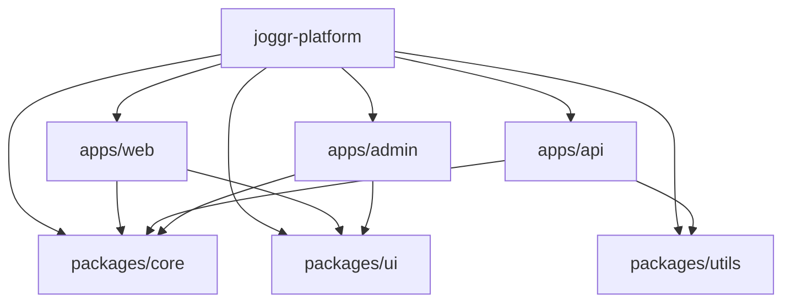

# 📂 Repository Structure

This guide explains the organization and structure of the Joggr Platform repository.

## 🗺️ Overall Structure

```ascii
joggr-platform/
├── .github/            # GitHub workflows and templates
├── packages/           # Core packages for the monorepo
├── apps/               # Applications built on the platform
├── docs/               # Documentation for the platform
├── scripts/            # Build and utility scripts
└── README.md           # Repository documentation
```

## 📁 Key Directories

### packages

Purpose: Contains shared libraries and core functionality

```ascii
packages/
├── core/               # Core platform functionality
├── ui/                 # Shared UI components
└── utils/              # Utility functions and helpers
```

### apps

Purpose: Contains deployable applications

```ascii
apps/
├── web/                # Main web application
├── api/                # Backend API service
└── admin/              # Admin dashboard
```

## ⚙️ Configuration Files

| File | Purpose | Configuration Guide |
|------|---------|---------------------|
| package.json | Defines dependencies and scripts | [Guide](https://docs.joggr.io/config/package-json) |
| tsconfig.json | TypeScript configuration | [Guide](https://docs.joggr.io/config/typescript) |

## 📦 Monorepo Structure



## 🚀 Adding New Components

Follow these guidelines when adding new components or modules:

1. Create new packages in the appropriate directory (packages/ for shared code, apps/ for applications)
2. Follow the established naming conventions and file structure
3. Update the dependency graph in the README.md if necessary

## 🔍 Related Documents

- [Local Setup Guide](../project/setup-local-environment.md)
- [Contribution Guidelines](../project/contribution-guidelines.md)
- [Architecture Overview](../architecture/service-architecture.md)

## 📚 Additional Resources

- [Monorepo Best Practices](https://docs.joggr.io/best-practices/monorepo)
- [Codebase Tour](https://docs.joggr.io/onboarding/codebase-tour)
- [Directory Structure Standards](https://docs.joggr.io/standards/directory-structure)
