# 🚀 CI/CD Pipeline

This document outlines the Continuous Integration and Continuous Deployment (CI/CD) pipeline for Joggr Platform.

## 🎯 Pipeline Overview

```mermaid
graph LR
  commit[Git Commit] --> build[Build]
  build --> test[Test]
  test --> lint[Lint & Type Check]
  lint --> deploy_staging[Deploy to Staging]
  deploy_staging --> integration_test[Integration Tests]
  integration_test --> approve{Approval}
  approve --> deploy_prod[Deploy to Production]
  
  style commit fill:#f6f8fa,stroke:#cfd7e6,stroke-width:1px
  style build fill:#1e88e5,color:white,stroke:#1565c0,stroke-width:2px
  style test fill:#43a047,color:white,stroke:#388e3c,stroke-width:2px
  style lint fill:#8e24aa,color:white,stroke:#6a1b9a,stroke-width:2px
  style deploy_staging fill:#fb8c00,color:white,stroke:#ef6c00,stroke-width:2px
  style integration_test fill:#43a047,color:white,stroke:#388e3c,stroke-width:2px
  style approve fill:#f9a825,color:white,stroke:#f57f17,stroke-width:2px
  style deploy_prod fill:#e53935,color:white,stroke:#c62828,stroke-width:2px
```



## ⚙️ CI Configuration

### GitHub Actions Configuration

```yaml
# Example configuration for GitHub Actions
name: CI/CD Pipeline

on:
  push:
    branches: [main]
  pull_request:
    branches: [main]

jobs:
  build:
    runs-on: ubuntu-latest
    steps:
      - uses: actions/checkout@v3
      - uses: pnpm/action-setup@v2
      - uses: actions/setup-node@v3
        with:
          node-version: 20
          cache: 'pnpm'
      - run: pnpm install
      - run: pnpm build
      
  test:
    needs: build
    runs-on: ubuntu-latest
    steps:
      - uses: actions/checkout@v3
      - uses: pnpm/action-setup@v2
      - uses: actions/setup-node@v3
        with:
          node-version: 20
          cache: 'pnpm'
      - run: pnpm install
      - run: pnpm test
      
  lint:
    needs: test
    runs-on: ubuntu-latest
    steps:
      - uses: actions/checkout@v3
      - uses: pnpm/action-setup@v2
      - uses: actions/setup-node@v3
        with:
          node-version: 20
          cache: 'pnpm'
      - run: pnpm install
      - run: pnpm lint
      - run: pnpm typecheck
```

## 🔄 Pipeline Stages

| Stage | Description | Timeout | Failure Action |
|-------|-------------|---------|----------------|
| Build | Compiles the application and creates artifacts | 10 minutes | Fail the pipeline and notify the team |
| Test | Runs unit and integration tests | 15 minutes | Fail the pipeline and notify the team |
| Lint | Checks code style and type errors | 5 minutes | Fail the pipeline and notify the team |
| Deploy to Staging | Deploys the application to the staging environment | 10 minutes | Retry once, then fail and notify the team |
| Integration Tests | Runs end-to-end tests against the staging environment | 20 minutes | Fail the pipeline and notify the team |
| Approval | Manual approval step for production deployments | 24 hours | Cancel the deployment if not approved |
| Deploy to Production | Deploys the application to the production environment | 15 minutes | Rollback to previous version and notify the team |

## 🔐 Environment Variables & Secrets

| Name | Description | Used In | Managed By |
|------|-------------|---------|------------|
| NODE_ENV | Environment name (development, staging, production) | All stages | CI/CD system |
| AWS_ACCESS_KEY_ID | AWS access key for deployments | Deploy stages | Security team via GitHub Secrets |
| AWS_SECRET_ACCESS_KEY | AWS secret key for deployments | Deploy stages | Security team via GitHub Secrets |
| DATABASE_URL | Connection string for the database | Test and deploy stages | DevOps team via GitHub Secrets |

## 🛠️ Troubleshooting

| Issue | Solution | Contact |
|-------|----------|---------|
| Build failures | Check for dependency issues or compilation errors | Frontend team |
| Test failures | Review test logs for specific failures | QA team |
| Deployment failures | Check AWS credentials and deployment logs | DevOps team |

## 🔍 Related Documents

- [Deployment Guide](../project/deployment-guide.md)
- [Testing Strategy](../testing/testing-strategy.md)
- [Infrastructure Overview](../architecture/infrastructure.md)

## 📚 Additional Resources

- [GitHub Actions Documentation](https://docs.github.com/en/actions)
- [Deployment Runbooks](../operations/runbooks.md)
- [Release Process](../operations/release-process.md)
