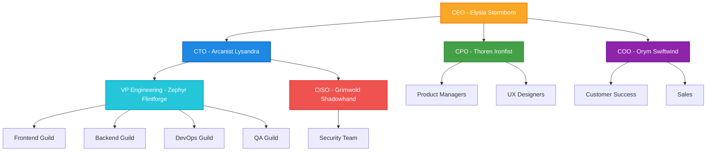

# 👥 Team Structure

This document outlines the organizational structure of Spellforge Technologies, including teams, roles, and reporting relationships.

## 🏰 Organization Chart

## 🧙‍♂️ Engineering Guilds

### Frontend Guild

**Leader:** Aria Moonwhisper, Principal Engineer

**Focus:** Building magical user experiences using React, TypeScript, and our Spellbook component library.

**Key Responsibilities:**
- Developing the Codex web application
- Maintaining the Spellbook component library
- Implementing accessibility standards
- Frontend performance optimization

### Backend Guild

**Leader:** Tordek Stoneshield, Principal Engineer

**Focus:** Creating powerful and scalable API services using Node.js, TypeScript, and PostgreSQL.

**Key Responsibilities:**
- Developing the Arcane API service
- Database design and optimization
- Service architecture
- API security and authentication

### DevOps Guild

**Leader:** Vex Cloudweaver, Principal DevOps Engineer

**Focus:** Building and maintaining our cloud infrastructure using AWS, Terraform, and Kubernetes.

**Key Responsibilities:**
- CI/CD pipeline management
- Infrastructure as Code
- Monitoring and alerting
- Performance optimization

### QA Guild

**Leader:** Lina Trustseeker, QA Manager

**Focus:** Ensuring the quality of our products through automated and manual testing.

**Key Responsibilities:**
- Test automation
- Manual testing
- Performance testing
- Accessibility testing

## 🗺️ Cross-Functional Teams

We organize our work in cross-functional teams aligned with product areas:

| Team | Focus | Members |
|------|-------|---------|
| Grimoire | Core documentation platform | Frontend, Backend, QA, Product, Design |
| Portals | Integrations and API | Frontend, Backend, DevOps, QA, Product |
| Arcana | Analytics and Insights | Frontend, Backend, Data, QA, Product |
| Foundry | Infrastructure and Platform | DevOps, Backend, Security |

## 🔄 Communication Channels

| Channel | Purpose | Primary Users | Frequency |
|---------|---------|---------------|-----------|
| All-Hands | Company updates | Everyone | Bi-weekly |
| Engineering Sync | Technical updates | Engineering team | Weekly |
| Guild Meetings | Guild-specific discussions | Guild members | Weekly |
| Product Sync | Product roadmap and priorities | Product and Engineering leads | Weekly |
| Retro | Team retrospectives | Cross-functional teams | End of sprint |

## 🔍 Related Documents

- [Onboarding Guide](../02-onboarding/01-welcome-guide.md)
- [Communication Guidelines](./02-communication-guidelines.md)
- [Decision Making Process](./03-decision-making.md)
- [Engineering Levels](../../02-engineering/02-development/02-engineering-levels.md)

## 📚 Additional Resources

- [Team Calendar](https://calendar.spellforge.tech)
- [Org Chart (interactive)](https://orgchart.spellforge.tech)
- [Team Photos](https://photos.spellforge.tech/team)
