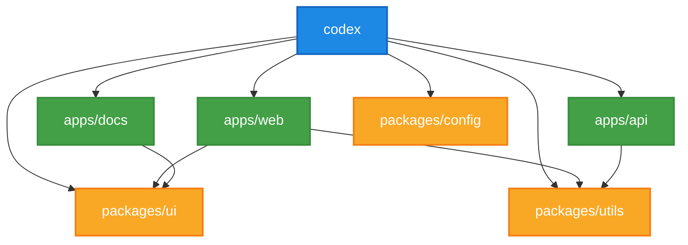

# 📂 Repository Structure

This guide explains the organization and structure of the Spellforge Codex repository.

## 🗺️ Overall Structure

```ascii
codex/
├── .github/            # GitHub workflows and templates
├── apps/               # Deployable applications
├── packages/           # Shared libraries
├── docs/               # Documentation
├── scripts/            # Utility scripts
├── docker/             # Docker configurations
├── .eslintrc.js        # ESLint configuration
├── .prettierrc         # Prettier configuration
├── package.json        # Root package.json
├── pnpm-workspace.yaml # pnpm workspace config
├── turbo.json          # Turborepo configuration
└── README.md           # Repository documentation
```

## 📁 Key Directories

### apps/

Purpose: Contains deployable applications

```ascii
apps/
├── web/                # Frontend web application
│   ├── src/            # Source code
│   ├── public/         # Static assets
│   ├── tests/          # Tests
│   └── package.json    # Package configuration
├── api/                # Backend API service
│   ├── src/            # Source code
│   ├── prisma/         # Database schema
│   ├── tests/          # Tests
│   └── package.json    # Package configuration
└── docs/               # Documentation site
    ├── src/            # Source code
    ├── content/        # Markdown content
    ├── public/         # Static assets
    └── package.json    # Package configuration
```

### packages/

Purpose: Contains shared libraries used across applications

```ascii
packages/
├── ui/                 # UI component library
│   ├── src/            # Source code
│   ├── stories/        # Storybook stories
│   ├── tests/          # Tests
│   └── package.json    # Package configuration
├── config/             # Shared configurations
│   ├── eslint/         # ESLint configurations
│   ├── typescript/     # TypeScript configurations
│   └── package.json    # Package configuration
└── utils/              # Shared utilities
    ├── src/            # Source code
    ├── tests/          # Tests
    └── package.json    # Package configuration
```

## ⚙️ Configuration Files

| File | Purpose | Configuration Guide |
|------|---------|---------------------|
| .eslintrc.js | Linting rules | [ESLint Configuration](https://eslint.org/docs/user-guide/configuring/) |
| .prettierrc | Code formatting | [Prettier Configuration](https://prettier.io/docs/en/configuration.html) |
| tsconfig.json | TypeScript configuration | [TypeScript Configuration](https://www.typescriptlang.org/docs/handbook/tsconfig-json.html) |
| pnpm-workspace.yaml | Workspace definition | [pnpm Workspace](https://pnpm.io/workspaces) |
| turbo.json | Build system configuration | [Turborepo Configuration](https://turbo.build/repo/docs/reference/configuration) |

## 📦 Monorepo Structure



## 🚀 Adding New Components

Follow these guidelines when adding new components or modules:

1. **Apps**: New deployable applications should be added to the `apps/` directory
2. **Packages**: Shared code should be added to the `packages/` directory
3. **Components**: UI components should be added to the `packages/ui` directory
4. **Utilities**: Shared utilities should be added to the `packages/utils` directory

## 🔍 Related Documents

- [Development Environment Setup](./01-setup-guide.md)
- [Tooling Guide](./02-tooling-guide.md)
- [Contribution Guidelines](../02-development/08-contribution-guidelines.md)
- [Architecture Overview](../02-development/04-architecture-overview.md)

## 📚 Additional Resources

- [Monorepo Best Practices](https://monorepo.tools/)
- [Turborepo Documentation](https://turbo.build/repo/docs)
- [pnpm Workspace Documentation](https://pnpm.io/workspaces)
