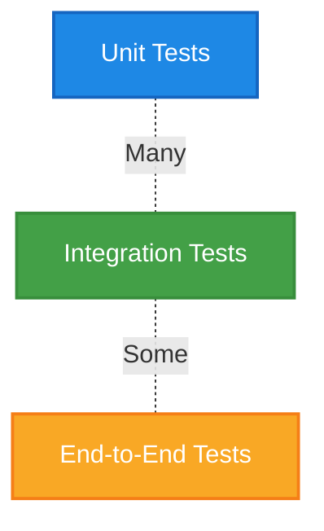

# 🧪 Testing Strategy

This document outlines the testing strategy for the Spellforge Codex project, covering test types, tools, and best practices.

## 🎯 Testing Pyramid



## 📊 Test Coverage Goals

| Test Type | Target Coverage | Tools | Owner |
|-----------|----------------|-------|-------|
| Unit Tests | 80% | Jest, React Testing Library | Frontend Guild |
| Integration Tests | 60% | Jest, Supertest | Backend Guild |
| E2E Tests | Critical paths only | Cypress | QA Guild |

## 🔎 Test Types & Scope

### Unit Tests

- **Scope**: Individual functions, components, and modules
- **When to Write**: For all new code, focusing on business logic and edge cases
- **Examples**:
  - Testing a utility function that formats dates
  - Testing a React component renders correctly with different props
  - Testing a service method handles errors properly

### Integration Tests

- **Scope**: API endpoints, database interactions, service integrations
- **When to Write**: For all API endpoints and service interactions
- **Examples**:
  - Testing an API endpoint returns correct data
  - Testing database queries and transactions
  - Testing interactions between multiple services

### End-to-End Tests

- **Scope**: Complete user flows and critical paths
- **When to Write**: For critical user journeys and high-risk features
- **Examples**:
  - User registration and login flow
  - Document creation and sharing workflow
  - Search functionality across the platform

## 🧮 Test Data Management

| Data Type | Management Strategy | Tools |
|-----------|---------------------|-------|
| Mock Data | Generated in-memory for unit tests | Faker.js, Jest mocks |
| Fixtures | JSON files for consistent test data | Custom fixtures, factory functions |
| Test Database | Isolated database instance with migrations | Docker, TestContainers |

## 🚀 Running Tests

### Locally

```bash
# Run all tests
pnpm test

# Run unit tests only
pnpm test:unit

# Run integration tests only
pnpm test:integration

# Run E2E tests only
pnpm test:e2e
```

### In CI/CD

```yaml
# Example CI/CD configuration snippet
jobs:
  test:
    runs-on: ubuntu-latest
    steps:
      - uses: actions/checkout@v3
      - uses: pnpm/action-setup@v2
      - uses: actions/setup-node@v3
        with:
          node-version: 20
          cache: 'pnpm'
      - run: pnpm install
      - run: pnpm test:unit
      - run: pnpm test:integration
      - run: pnpm test:e2e
```

## 🧙‍♂️ Testing Best Practices

1. **Write tests first** - Follow TDD where possible
2. **Keep tests fast** - Optimize for quick feedback loops
3. **One assertion per test** - Tests should be focused and specific
4. **Use descriptive test names** - Clearly describe what's being tested
5. **Isolate tests** - Tests should not depend on each other
6. **Mock external dependencies** - Don't rely on external services in unit tests
7. **Test edge cases** - Consider boundary conditions and error scenarios
8. **Maintain test quality** - Tests should be treated as production code

## 🔍 Related Documents

- [Code Style Standards](../02-development/07-code-style.md)
- [CI/CD Pipeline](../../03-operations/02-deployment/02-ci-cd-pipeline.md)
- [Development Workflow](../02-development/05-development-workflow.md)
- [QA Process](./02-qa-process.md)

## 📚 Additional Resources

- [Jest Documentation](https://jestjs.io/docs/getting-started)
- [Cypress Documentation](https://docs.cypress.io/)
- [React Testing Library Documentation](https://testing-library.com/docs/react-testing-library/intro/)
- [Testing Best Practices](https://docs.spellforge.tech/testing/best-practices)
