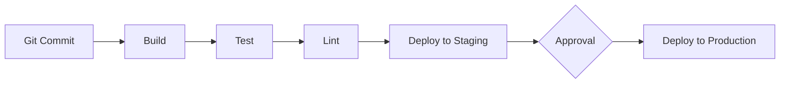

# 🚀 CI/CD Pipeline

This document outlines our Continuous Integration and Continuous Deployment (CI/CD) pipeline.

## 🎯 Pipeline Overview



## ⚙️ Basic Configuration

```yaml
# Example GitHub Actions workflow
name: CI/CD Pipeline

on:
  push:
    branches: [main]
  pull_request:
    branches: [main]

jobs:
  build:
    runs-on: ubuntu-latest
    steps:
      - uses: actions/checkout@v3
      - uses: pnpm/action-setup@v2
      - uses: actions/setup-node@v3
      - run: pnpm install
      - run: pnpm build
```

## 🔄 Deployment Workflow

1. **Feature Branch**
   - Developer creates a feature branch
   - CI runs build, test, and lint on pull requests

2. **Merge to Main**
   - Pull request is reviewed and approved
   - Changes are merged to main
   - CI automatically deploys to staging

3. **Production Deployment**
   - Engineering lead approves deployment
   - CI deploys to production

## 🔍 Related Documents

- [Testing Strategy](../../02-engineering/03-testing/01-testing-strategy.md)
