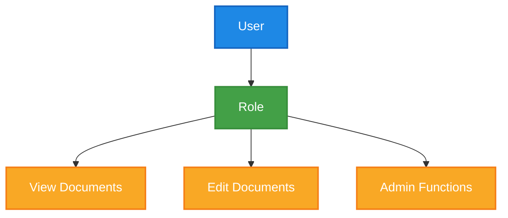

# 🛡️ Security Standards

This document outlines the security standards and best practices for Spellforge Technologies to ensure the protection of our systems and data.

## 🎯 Core Principles

1. **Defense in Depth** - Multiple layers of security controls
2. **Least Privilege** - Minimal access required for job functions
3. **Secure by Design** - Security built into development process
4. **Zero Trust** - Verify everything, trust nothing
5. **Continuous Monitoring** - Ongoing vigilance for threats

## 🔒 Authentication & Authorization

### Authentication Standards

| Requirement | Standard | Implementation |
|-------------|----------|----------------|
| Password Complexity | Minimum 12 characters, mix of uppercase, lowercase, numbers, and symbols | Enforced via Auth0 policies |
| MFA | Required for all production access and admin accounts | Implemented with Auth0 and TOTP |
| Session Management | 8-hour session timeout, with refresh tokens valid for 30 days | Implemented in API with JWT |
| Failed Login Attempts | Account lockout after 5 failed attempts | Enforced via Auth0 policies |

### Authorization Model

## 🔐 Secure Coding Practices

### Input Validation

| Input Type | Validation Requirement | Example |
|------------|------------------------|---------|
| User Input | Validate against schema, sanitize HTML | Using Zod for schema validation and DOMPurify for HTML sanitization |
| File Uploads | Validate file type, scan for malware | Using content-type validation and ClamAV integration |
| API Parameters | Validate against API schema | Using OpenAPI validation middleware |

### Output Encoding

| Context | Encoding Requirement | Example |
|---------|----------------------|---------|
| HTML | Escape all dynamic content | Using React's built-in XSS protection and DOMPurify |
| SQL | Use parameterized queries | Using Prisma ORM with prepared statements |
| JSON | Validate structure before parsing | Using JSON schema validation |

## 🧙‍♂️ Security Development Lifecycle

1. **Planning**
   - Threat modeling for new features
   - Security requirements definition

2. **Implementation**
   - Secure coding practices
   - Peer code reviews with security focus

3. **Verification**
   - SAST (Static Application Security Testing)
   - DAST (Dynamic Application Security Testing)
   - Dependency scanning

4. **Release**
   - Security sign-off
   - Vulnerability disclosure process

5. **Maintenance**
   - Regular security updates
   - Vulnerability management

## 🔍 Security Testing

| Test Type | Frequency | Tool | Owner |
|-----------|-----------|------|-------|
| SAST | Every PR | SonarCloud | Security Guild |
| DAST | Weekly | OWASP ZAP | Security Guild |
| Dependency Scanning | Daily | Dependabot | DevOps Guild |
| Penetration Testing | Quarterly | External Security Firm | Security Guild |

## 🚨 Security Incident Response

### Incident Severity Levels

| Level | Description | Response Time | Notification |
|-------|-------------|---------------|-------------|
| Critical | Data breach, system compromise | Immediate (< 1 hour) | All hands, executive team, affected customers |
| High | Potential breach, significant vulnerability | < 4 hours | Security team, engineering leads |
| Medium | Non-critical vulnerability, suspicious activity | < 24 hours | Security team |
| Low | Minor issues, policy violations | < 1 week | Team lead |

## 🔍 Related Documents

- [Incident Management Process](../02-compliance/01-incident-management.md)
- [Deployment Security Checklist](../../03-operations/02-deployment/05-security-checklist.md)
- [Data Protection Policy](../01-standards/02-data-protection.md)
- [Access Control Policy](../01-standards/03-access-control.md)

## 📚 Additional Resources

- [OWASP Top 10](https://owasp.org/www-project-top-ten/)
- [Spellforge Security Handbook](https://security.spellforge.tech)
- [Security Training Resources](https://training.spellforge.tech/security)
