<!--  
📝 Usage:  
- Replace *placeholders* with relevant details.  
- Update links and remove unnecessary sections.  
- Customize as needed.  

Happy documenting! 🚀  
-->

# 📊 System Overview

This document provides you with an overview of the services (applications), vendors and other assets that make up the our platform and how they interact.

## Services

There are four primary services that make up our platform.
| Service                      | Description                                                                                                                                   | Endpoint               |
|-----------------------------|-----------------------------------------------------------------------------------------------------------------------------------------------|------------------------|
| 🔌 **API**                  | The ENTER_COMPANY **API** is the main API for our Platform. It is responsible for all of the business logic and data storage for the Platform. | `https://api.acme.io` |
| 🌐 **Web**                  | The ENTER_COMPANY **Web** consists of a React-based application that is a SPA.                                                                | `https://app.acme.io` |
| ⚙ **Server**               | The ENTER_COMPANY **Server** is a Fastify based API that serves the **Web** to the client.                                                     | `https://app.acme.io` |
| 🔗 **Third-Party Service**  | The ENTER_COMPANY **Third-Party Service** is a proxy API for ENTER_REASON. It is responsible for ENTER_REASON.                                | `https://app.acme.io` |

## System Diagram

```mermaid
%%{init: {
  'theme': 'default',
  'themeVariables': {
    'primaryColor': '#f4f4f4',
    'primaryTextColor': '#333',
    'primaryBorderColor': '#888',
    'lineColor': '#555',
    'secondaryColor': '#eee',
    'tertiaryColor': '#fff'
  }
}}%%

flowchart TD
    %% Title
    title["Acme Inc. Service Architecture"]
    style title fill:none,stroke:none,color:#333,font-weight:bold

    %% Core Services - using round shapes with parentheses
    web("🌐 Web Client\napp.acme.io")
    style web fill:#7b1fa2,color:white,stroke:#5d1777,stroke-width:2px

    api("⬆️ Backend API\napi.acme.io")
    style api fill:#7b1fa2,color:white,stroke:#5d1777,stroke-width:2px

    server("💻 Web Server\nStatic Content")
    style server fill:#7b1fa2,color:white,stroke:#5d1777,stroke-width:2px

    third-party("🐙 Third-Party Proxy\nAPI & App Integration")
    style third-party fill:#00897b,color:white,stroke:#005b4f,stroke-width:2px

    %% AWS Services
    database[("🐘 MicrosoftSQL\nCloudSQL")]
    style database fill:#0064a5,color:white,stroke:#004c7f,stroke-width:2px

    bucket("🪣 Storage Bucket\nCloud Storage")
    style bucket fill:#0064a5,color:white,stroke:#004c7f,stroke-width:2px

    %% Vendor Services
    Okta("🔐 Okta.com\nIdentity Provider")
    style Okta fill:#f57c00,color:white,stroke:#bc5100,stroke-width:2px

    thirdpartyapi("🔌 thirdparty.com\nExternal API")
    style thirdpartyapi fill:#f57c00,color:white,stroke:#bc5100,stroke-width:2px

    %% Connections with descriptive labels
    web -- "Serves UI" --> server
    web <-- "API Requests" --> api
    web <-- "CDN Assets" --> api
    api <-- "Static Assets" --> bucket
    api <-- "Auth" --> Okta
    web <-- "Login" --> Okta
    third-party <-- "Proxy Requests" --> thirdpartyapi
    api -- "Database Queries" --> database

    %% Subgraph containers
    subgraph vpc ["🛜 VPC Network"]
        direction TB
        api -- "Internal API Calls" --> third-party
        server
        api
    end
    style vpc fill:#e3f2fd,color:#0d47a1,stroke:#0d47a1,stroke-width:3px,stroke-dasharray:5

    subgraph gcp ["💽 AWS Managed Services"]
        direction TB
        database
        bucket
    end
    style gcp fill:#e1f5fe,color:#01579b,stroke:#01579b,stroke-width:3px,stroke-dasharray:5

    subgraph vendors ["🏪 External Vendors"]
        direction TB
        thirdpartyapi
        Okta
    end
    style vendors fill:#fff3e0,color:#e65100,stroke:#e65100,stroke-width:3px,stroke-dasharray:5

    %% Global link styling
    linkStyle default stroke-width:2px,stroke:#666
```

