<!--@@joggrdoc@@-->
<!-- @joggr:version(v2):end -->
<!-- @joggr:warning:start -->
<!-- 
  _   _   _    __        __     _      ____    _   _   ___   _   _    ____     _   _   _ 
 | | | | | |   \ \      / /    / \    |  _ \  | \ | | |_ _| | \ | |  / ___|   | | | | | |
 | | | | | |    \ \ /\ / /    / _ \   | |_) | |  \| |  | |  |  \| | | |  _    | | | | | |
 |_| |_| |_|     \ V  V /    / ___ \  |  _ <  | |\  |  | |  | |\  | | |_| |   |_| |_| |_|
 (_) (_) (_)      \_/\_/    /_/   \_\ |_| \_\ |_| \_| |___| |_| \_|  \____|   (_) (_) (_)
                                                              
This document is managed by Joggr. Editing this document could break Joggr's core features, i.e. our 
ability to auto-maintain this document. Please use the Joggr editor to edit this document 
(link at bottom of the page).
-->
<!-- @joggr:warning:end -->
# **Deployment Guide**

## **Environments**

<table class="dashdraft-table">
  <tbody>
    <tr class="dashdraft-table-row">
      <th class="dashdraft-table-header" colspan="1" rowspan="1">
        
Environment

      </th>
      <th class="dashdraft-table-header" colspan="1" rowspan="1">
        
Description

      </th>
      <th class="dashdraft-table-header" colspan="1" rowspan="1">
        
URL

      </th>
    </tr>
    <tr class="dashdraft-table-row">
      <td class="dashdraft-table-cell" colspan="1" rowspan="1">
        
<strong class="dashdraft-bold">Staging</strong>

      </td>
      <td class="dashdraft-table-cell" colspan="1" rowspan="1">
        
Pre-production testing environment.

      </td>
      <td class="dashdraft-table-cell" colspan="1" rowspan="1">
        
staging.example.com

      </td>
    </tr>
    <tr class="dashdraft-table-row">
      <td class="dashdraft-table-cell" colspan="1" rowspan="1">
        
<strong class="dashdraft-bold">Production</strong>

      </td>
      <td class="dashdraft-table-cell" colspan="1" rowspan="1">
        
Live environment.

      </td>
      <td class="dashdraft-table-cell" colspan="1" rowspan="1">
        
production.example.com

      </td>
    </tr>
    <tr class="dashdraft-table-row">
      <td class="dashdraft-table-cell" colspan="1" rowspan="1">
        
<strong class="dashdraft-bold">Sandbox</strong>

      </td>
      <td class="dashdraft-table-cell" colspan="1" rowspan="1">
        
Rarely used, but available for experimentation.

      </td>
      <td class="dashdraft-table-cell" colspan="1" rowspan="1">
        
sandbox.example.com

      </td>
    </tr>
  </tbody>
</table>

## **Deployment Steps (GitHub Actions)**

* Push changes to the repository to trigger **GitHub Actions**.

* The workflow runs tests, builds, and packages the application.

* If tests pass, the deployment is pushed to **staging**.

* After verification, an **approval step** is required for **production deployment**.

* **Tag the release** before deploying to production.

```mermaid
graph TD;
    A[📌 Code Commit] -->|🚀 GitHub Actions Triggered| B[🛠️ Run Tests];
    B -->|📦 Build & Package| C[🚀 Deploy to Staging];
    C -->|✅ Verification| D[🏷️ Tag Release & Approve Deployment];
    D -->|🚀 Deploy to Production| E[🎉 Success];
    D -->|❌ Failure| F[🔄 Rollback];
```

## **Rollback Plan**

* Identify the issue and confirm rollback necessity.

* Use **GitHub Actions rollback workflow** to revert to the previous stable release.

```mermaid
graph TD;
    A[🚨 Issue Detected] -->|🔍 Assess Impact| B[✅ Confirm Necessity];
    B -->|⚙️ Run Script| C[🔄 Trigger Rollback Workflow];
    C -->|🔬 Run Tests| D[✅ Validate Rollback];
    D -->|📝 Post-Mortem| E[📄 Document & Improve];
```

<!-- @joggr:editLink(436dc2f7-4056-46e3-9194-0c734a81067e):start -->
---

<!-- @joggr:editLink(436dc2f7-4056-46e3-9194-0c734a81067e):end -->
