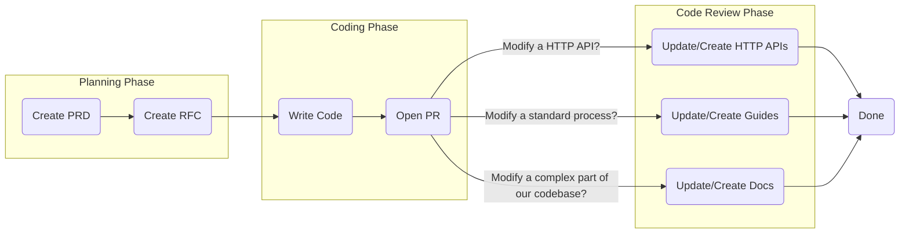

<!--@@joggrdoc@@-->
<!-- @joggr:version(v2):end -->
<!-- @joggr:warning:start -->
<!-- 
  _   _   _    __        __     _      ____    _   _   ___   _   _    ____     _   _   _ 
 | | | | | |   \ \      / /    / \    |  _ \  | \ | | |_ _| | \ | |  / ___|   | | | | | |
 | | | | | |    \ \ /\ / /    / _ \   | |_) | |  \| |  | |  |  \| | | |  _    | | | | | |
 |_| |_| |_|     \ V  V /    / ___ \  |  _ <  | |\  |  | |  | |\  | | |_| |   |_| |_| |_|
 (_) (_) (_)      \_/\_/    /_/   \_\ |_| \_\ |_| \_| |___| |_| \_|  \____|   (_) (_) (_)
                                                              
This document is managed by Joggr. Editing this document could break Joggr's core features, i.e. our 
ability to auto-maintain this document. Please use the Joggr editor to edit this document 
(link at bottom of the page).
-->
<!-- @joggr:warning:end -->
## 📜 Our Three Core Rules for Documentation

1. **Anonymity** – Docs reflect team knowledge, not individual authors.

2. **Clarity** – The name and summary should make the purpose obvious.

3. **Discoverability** – Docs live where you'd logically expect them.

Following these rules means:

* 🚀 **Faster dev work** – No more getting stuck in question purgatory.

* 🛹 **Smoother onboarding** – New devs ramp up without roadblocks.

* 🔮 **Future-you will thank you** – When debugging your own cryptic code, good docs are a lifesaver.

## What You'll Learn

Please read this document, and apply it to your documentation writing! In this document, you will find all of the following:

<table class="dashdraft-table">
  <tbody>
    <tr class="dashdraft-table-row">
      <th class="dashdraft-table-header" colspan="1" rowspan="1">
        
Section

      </th>
      <th class="dashdraft-table-header" colspan="1" rowspan="1">
        
What You'll Learn

      </th>
    </tr>
    <tr class="dashdraft-table-row">
      <td class="dashdraft-table-cell" colspan="1" rowspan="1">
        
Types of Documentation

      </td>
      <td class="dashdraft-table-cell" colspan="1" rowspan="1">
        
You'll learn about how we define certain types of documentation.

      </td>
    </tr>
    <tr class="dashdraft-table-row">
      <td class="dashdraft-table-cell" colspan="1" rowspan="1">
        
When to Create JoggrDocs

      </td>
      <td class="dashdraft-table-cell" colspan="1" rowspan="1">
        
You'll learn when we expect developers to create certain types of documentation.

      </td>
    </tr>
    <tr class="dashdraft-table-row">
      <td class="dashdraft-table-cell" colspan="1" rowspan="1">
        
How to Create JoggrDocs

      </td>
      <td class="dashdraft-table-cell" colspan="1" rowspan="1">
        
You'll learn what we expect when you create documentation (e.g. naming conventions)

      </td>
    </tr>
    <tr class="dashdraft-table-row">
      <td class="dashdraft-table-cell" colspan="1" rowspan="1">
        
Where to Save Documentation

      </td>
      <td class="dashdraft-table-cell" colspan="1" rowspan="1">
        
You'll learn where to save documentation in Joggr &#x26; GitHub.

      </td>
    </tr>
  </tbody>
</table>

## Software Development Process

It's important to understand that documentation is a continuous part of our process and a key component of our Software Development Process. This diagram provides an overview of how documentation is integrated into our development process.

### Types of Documentation

<table class="dashdraft-table">
  <tbody>
    <tr class="dashdraft-table-row">
      <th class="dashdraft-table-header" colspan="1" rowspan="1">
        
Category

      </th>
      <th class="dashdraft-table-header" colspan="1" rowspan="1">
        
Description

      </th>
    </tr>
    <tr class="dashdraft-table-row">
      <td class="dashdraft-table-cell" colspan="1" rowspan="1">
        
Request for Comment (RFC)

      </td>
      <td class="dashdraft-table-cell" colspan="1" rowspan="1">
        
RFCs help developers think through a design or feature before coding. Use RFCs to think through a design &#x26; get feedback from the team.

      </td>
    </tr>
    <tr class="dashdraft-table-row">
      <td class="dashdraft-table-cell" colspan="1" rowspan="1">
        
Architecture

      </td>
      <td class="dashdraft-table-cell" colspan="1" rowspan="1">
        
An architecture document shows the architecture of the system &#x26; how different components interact.

      </td>
    </tr>
    <tr class="dashdraft-table-row">
      <td class="dashdraft-table-cell" colspan="1" rowspan="1">
        
Guides

      </td>
      <td class="dashdraft-table-cell" colspan="1" rowspan="1">
        
A guide shows developers how to complete a task (e.g. how to deploy).

      </td>
    </tr>
    <tr class="dashdraft-table-row">
      <td class="dashdraft-table-cell" colspan="1" rowspan="1">
        
Walkthroughs

      </td>
      <td class="dashdraft-table-cell" colspan="1" rowspan="1">
        
A walkthrough shows developers how something works, often "walking" a developer through the code (i.e. How Authentication Works).

      </td>
    </tr>
  </tbody>
</table>

### Joggr Directory Structure

Below is our Directory Structure in Joggr. Please make sure to save all documents to the correct position.

<table class="dashdraft-table">
  <tbody>
    <tr class="dashdraft-table-row">
      <th class="dashdraft-table-header" colspan="1" rowspan="1">
        
Folder

      </th>
      <th class="dashdraft-table-header" colspan="1" rowspan="1">
        
Description

      </th>
    </tr>
    <tr class="dashdraft-table-row">
      <td class="dashdraft-table-cell" colspan="1" rowspan="1">
        
<code class="dashdraft-code-inline">Overview</code>

      </td>
      <td class="dashdraft-table-cell" colspan="1" rowspan="1">
        
Describe in 1-2 sentences what documentation should be saved to this folder.

      </td>
    </tr>
    <tr class="dashdraft-table-row">
      <td class="dashdraft-table-cell" colspan="1" rowspan="1">
        
<code class="dashdraft-code-inline">Standards</code>

      </td>
      <td class="dashdraft-table-cell" colspan="1" rowspan="1">
        
Describe in 1-2 sentences what documentation should be saved to this folder.

      </td>
    </tr>
    <tr class="dashdraft-table-row">
      <td class="dashdraft-table-cell" colspan="1" rowspan="1">
        
<code class="dashdraft-code-inline">Architecture</code>

      </td>
      <td class="dashdraft-table-cell" colspan="1" rowspan="1">
        
Describe in 1-2 sentences what documentation should be saved to this folder.

      </td>
    </tr>
    <tr class="dashdraft-table-row">
      <td class="dashdraft-table-cell" colspan="1" rowspan="1">
        
<code class="dashdraft-code-inline">Frontend</code>

      </td>
      <td class="dashdraft-table-cell" colspan="1" rowspan="1">
        
Describe in 1-2 sentences what documentation should be saved to this folder.

      </td>
    </tr>
    <tr class="dashdraft-table-row">
      <td class="dashdraft-table-cell" colspan="1" rowspan="1">
        
<code class="dashdraft-code-inline">Backend</code>

      </td>
      <td class="dashdraft-table-cell" colspan="1" rowspan="1">
        
Describe in 1-2 sentences what documentation should be saved to this folder.

      </td>
    </tr>
  </tbody>
</table>

### GitHub Directory Structure

Below is our approach to storing docs in GitHub. We have two places to store docs in GitHub:

<table class="dashdraft-table">
  <tbody>
    <tr class="dashdraft-table-row">
      <th class="dashdraft-table-header" colspan="1" rowspan="1">
        
Area

      </th>
      <th class="dashdraft-table-header" colspan="1" rowspan="1">
        
Description

      </th>
    </tr>
    <tr class="dashdraft-table-row">
      <td class="dashdraft-table-cell" colspan="1" rowspan="1">
        
<a target="_blank" rel="noopener noreferrer" class="dashdraft-link" href="github.com">Tech-Docs Repository</a>

      </td>
      <td class="dashdraft-table-cell" colspan="1" rowspan="1">
        
This repository holds documentation that does not make sense to put in a specific repository (i.e. Code Review Standards).

      </td>
    </tr>
    <tr class="dashdraft-table-row">
      <td class="dashdraft-table-cell" colspan="1" rowspan="1">
        
<code class="dashdraft-code-inline">/docs</code> directory in a code repositories

      </td>
      <td class="dashdraft-table-cell" colspan="1" rowspan="1">
        
In every repository, we should have a <code class="dashdraft-code-inline">/docs</code> directory. If you are documenting something where it's obvious it should be saved in that repository, save it to the <code class="dashdraft-code-inline">/docs</code> folder.

      </td>
    </tr>
  </tbody>
</table>

> \[!NOTE]
>
> The Tech Docs Repostitory's file tree **should** mirror our Joggr file tree.

### When to Create JoggrDocs

We expect that software developers create documentation based on the following:

<table class="dashdraft-table">
  <tbody>
    <tr class="dashdraft-table-row">
      <th class="dashdraft-table-header" colspan="1" rowspan="1">
        
RFC

      </th>
      <th class="dashdraft-table-header" colspan="1" rowspan="1">
        
Arch.

      </th>
      <th class="dashdraft-table-header" colspan="1" rowspan="1">
        
Guides

      </th>
      <th class="dashdraft-table-header" colspan="1" rowspan="1">
        
Walkthroughs

      </th>
    </tr>
    <tr class="dashdraft-table-row">
      <td class="dashdraft-table-cell" colspan="1" rowspan="1">
        
<strong class="dashdraft-bold">MUST</strong> be created after approving the PRD and before starting development.

      </td>
      <td class="dashdraft-table-cell" colspan="1" rowspan="1">
        
<strong class="dashdraft-bold">MUST</strong> create an architecture diagram for any new large project.

      </td>
      <td class="dashdraft-table-cell" colspan="1" rowspan="1">
        
<strong class="dashdraft-bold">MUST</strong> be created or updated when a new standard process is introduced or an existing one is updated.

      </td>
      <td class="dashdraft-table-cell" colspan="1" rowspan="1">
        
<strong class="dashdraft-bold">MUST</strong> be created when the team starts asking lots of questions about a certain part of our codebase (e.g. how does authentication work)

      </td>
    </tr>
  </tbody>
</table>

### How to Create JoggrDocs

We expect software developers to follow these standards when creating documentation.

<table class="dashdraft-table">
  <tbody>
    <tr class="dashdraft-table-row">
      <th class="dashdraft-table-header" colspan="1" rowspan="1">
        
RFC

      </th>
      <th class="dashdraft-table-header" colspan="1" rowspan="1">
        
Arch.

      </th>
      <th class="dashdraft-table-header" colspan="1" rowspan="1">
        
Guides

      </th>
      <th class="dashdraft-table-header" colspan="1" rowspan="1">
        
Walkthroughs

      </th>
    </tr>
    <tr class="dashdraft-table-row">
      <td class="dashdraft-table-cell" colspan="1" rowspan="1">
        
<strong class="dashdraft-bold">MUST</strong> use the RFC Template

      </td>
      <td class="dashdraft-table-cell" colspan="1" rowspan="1">
        
<strong class="dashdraft-bold">MUST </strong>include a diagram

      </td>
      <td class="dashdraft-table-cell" colspan="1" rowspan="1">
        
<strong class="dashdraft-bold">MUST</strong> use the How-To Guide template

      </td>
      <td class="dashdraft-table-cell" colspan="1" rowspan="1">
        
<strong class="dashdraft-bold">MUST </strong>reference code examples where possible.

      </td>
    </tr>
  </tbody>
</table>

<!-- @joggr:editLink(284ccfba-f508-4d64-aaf4-cef948ae6e58):start -->
---

<!-- @joggr:editLink(284ccfba-f508-4d64-aaf4-cef948ae6e58):end -->
