<!--  
📝 Usage:  
- Replace all {{placeholders}} with your organization's content
- Update links and remove unnecessary sections
- Customize as needed 

Happy documenting! 🚀  
-->

# 🚀 CI/CD Pipeline

This document outlines the Continuous Integration and Continuous Deployment (CI/CD) pipeline for {{ project-name }}.

## 🎯 Pipeline Overview

```mermaid
graph LR
  commit[Git Commit] --> build[Build]
  build --> test[Test]
  test --> lint[Lint & Type Check]
  lint --> deploy_staging[Deploy to Staging]
  deploy_staging --> integration_test[Integration Tests]
  integration_test --> approve{Approval}
  approve --> deploy_prod[Deploy to Production]
  
  style commit fill:#f6f8fa,stroke:#cfd7e6,stroke-width:1px
  style build fill:#1e88e5,color:white,stroke:#1565c0,stroke-width:2px
  style test fill:#43a047,color:white,stroke:#388e3c,stroke-width:2px
  style lint fill:#8e24aa,color:white,stroke:#6a1b9a,stroke-width:2px
  style deploy_staging fill:#fb8c00,color:white,stroke:#ef6c00,stroke-width:2px
  style integration_test fill:#43a047,color:white,stroke:#388e3c,stroke-width:2px
  style approve fill:#f9a825,color:white,stroke:#f57f17,stroke-width:2px
  style deploy_prod fill:#e53935,color:white,stroke:#c62828,stroke-width:2px
```



## ⚙️ CI Configuration

### {{ ci-tool }} Configuration

```yaml
# Example configuration for {{ ci-tool }}
{{ ci-config }}
```

## 🔄 Pipeline Stages

| Stage | Description | Timeout | Failure Action |
|-------|-------------|---------|----------------|
| Build | {{ build-description }} | {{ build-timeout }} | {{ build-failure-action }} |
| Test | {{ test-description }} | {{ test-timeout }} | {{ test-failure-action }} |
| Lint | {{ lint-description }} | {{ lint-timeout }} | {{ lint-failure-action }} |
| Deploy to Staging | {{ deploy-staging-description }} | {{ deploy-staging-timeout }} | {{ deploy-staging-failure-action }} |
| Integration Tests | {{ integration-test-description }} | {{ integration-test-timeout }} | {{ integration-test-failure-action }} |
| Approval | {{ approval-description }} | {{ approval-timeout }} | {{ approval-failure-action }} |
| Deploy to Production | {{ deploy-prod-description }} | {{ deploy-prod-timeout }} | {{ deploy-prod-failure-action }} |

## 🔐 Environment Variables & Secrets

| Name | Description | Used In | Managed By |
|------|-------------|---------|------------|
| {{ env-var-1 }} | {{ env-var-1-description }} | {{ env-var-1-usage }} | {{ env-var-1-manager }} |
| {{ env-var-2 }} | {{ env-var-2-description }} | {{ env-var-2-usage }} | {{ env-var-2-manager }} |
| {{ env-var-3 }} | {{ env-var-3-description }} | {{ env-var-3-usage }} | {{ env-var-3-manager }} |

## 🛠️ Troubleshooting

| Issue | Solution | Contact |
|-------|----------|---------|
| {{ issue-1 }} | {{ solution-1 }} | {{ contact-1 }} |
| {{ issue-2 }} | {{ solution-2 }} | {{ contact-2 }} |
| {{ issue-3 }} | {{ solution-3 }} | {{ contact-3 }} |

## 🔍 Related Documents

- [Deployment Guide](../project/deployment-guide.md)
- [Testing Strategy](../testing/testing-strategy.md)
- [Infrastructure Overview](../architecture/infrastructure.md)

## 📚 Additional Resources

- [{{ ci-tool }} Documentation]({{ ci-tool-docs }})
- [Deployment Runbooks](../operations/runbooks.md)
- [Release Process](../operations/release-process.md)
