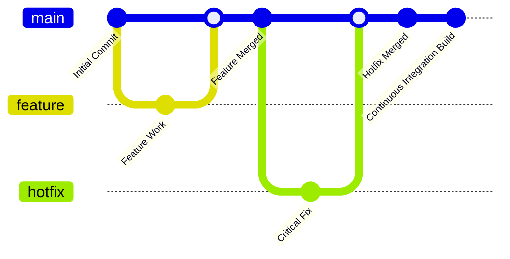

<!--  
�� Usage:  
- Replace all {{placeholders}} with your organization's content
- Update links and remove unnecessary sections
- Customize as needed 

Happy documenting! 🚀  
-->

# 📝 Contribution Guidelines

Welcome to the {{ app }} codebase! This guide outlines our contribution process and standards to maintain code quality and collaboration.

## 🎯 Development Workflow

### Branching Strategy

We follow **Trunk-Based Development** with the following branches:

| Branch Type | Pattern | Description | Lifecycle |
|-------------|---------|-------------|-----------|
| **Main** | `main` | Production-ready code | Long-lived |
| **Feature** | `feature/{{ feature-name }}` | New features | Short-lived |
| **Hotfix** | `hotfix/{{ issue-description }}` | Critical fixes | Very short-lived |
| **Release** | `v{{ version }}` | Release tags | Permanent |



## 🔍 Code Review Process

### Review Requirements

- **Approvals**: {{ required-approvals }} approvals required
- **Self-Review**: No self-merges allowed
- **Review Style**: Constructive feedback with actionable items
- **Documentation**: Update relevant documentation

### Review Guidelines

1. **Code Quality**
   - Follow coding standards
   - Include tests
   - Update documentation
   - No linting errors

2. **PR Description**
   - Clear title
   - Detailed description
   - Screenshots/GIFs when relevant
   - Link to related issues

3. **Commit Messages**
   ```bash
   # Format
   type(scope): description (#issue-number)
   
   # Example
   fix(auth): resolve login redirect issue (#123)
   ```

## ⏳ Pull Request Standards

### PR Requirements

| Requirement | Description |
|-------------|-------------|
| **Size** | Maximum {{ max-files }} files per PR |
| **Scope** | One feature/fix per PR |
| **Tests** | All tests must pass |
| **Documentation** | Update relevant docs |

### PR Template

```markdown
## Description
{{ pr-description }}

## Type of Change
- [ ] Bug fix
- [ ] New feature
- [ ] Breaking change
- [ ] Documentation update

## Testing
- [ ] Unit tests added/updated
- [ ] Integration tests added/updated
- [ ] Manual testing completed

## Documentation
- [ ] README updated
- [ ] API docs updated
- [ ] Release notes updated
```

## ⚡ Response Times

### Review SLAs

| Action | Timeframe | Escalation |
|--------|-----------|------------|
| Initial Review | {{ review-sla }} hours | @{{ reviewer-role }} |
| Follow-up | {{ followup-sla }} hours | @{{ team-lead }} |
| Merge | {{ merge-sla }} hours | @{{ tech-lead }} |

## 🛠️ Development Tools

### Required Tools

| Tool | Version | Usage |
|------|---------|-------|
| {{ tool-1 }} | {{ version-1 }} | {{ usage-1 }} |
| {{ tool-2 }} | {{ version-2 }} | {{ usage-2 }} |
| {{ tool-3 }} | {{ version-3 }} | {{ usage-3 }} |

### Code Quality Tools

```bash
# Format code
npm run format

# Run linter
npm run lint

# Run tests
npm test
```

## 🚀 Getting Started

1. **Fork the Repository**
   ```bash
   git clone {{ repository-url }}
   cd {{ repository-name }}
   ```

2. **Set Up Development Environment**
   ```bash
   npm install
   npm run setup
   ```

3. **Create Feature Branch**
   ```bash
   git checkout -b feature/{{ feature-name }}
   ```

## 🔍 Related Documents

- [Code Style Guide](../standards/code-style.md)
- [Testing Standards](../standards/testing.md)
- [Documentation Standards](../standards/documentation.md)

## 📚 Additional Resources

- [{{ app }} Documentation]({{ docs-url }})
- [API Reference]({{ api-docs-url }})
- [Architecture Overview](../architecture/overview.md)
