<!--  
�� Usage:  
- Replace all {{placeholders}} with your organization's content
- Update links and remove unnecessary sections
- Customize as needed 

Happy documenting! 🚀  
-->

# 🚀 Deployment Guide

This guide outlines the deployment process for {{ app }} across different environments.

## 🎯 Environments

| Environment | Description | URL | Access |
|------------|-------------|-----|---------|
| **Development** | Local development environment | {{ dev-url }} | {{ dev-access }} |
| **Staging** | Pre-production testing environment | {{ staging-url }} | {{ staging-access }} |
| **Production** | Live environment | {{ prod-url }} | {{ prod-access }} |
| **Sandbox** | Testing and experimentation | {{ sandbox-url }} | {{ sandbox-access }} |

## 🔄 Deployment Process

### Automated Deployment ({{ ci-tool }})

```mermaid
graph LR;
    A[📌 Code Commit] -->|🚀 {{ ci-tool }} Triggered| B[🛠️ Run Tests];
    B -->|📦 Build & Package| C[🚀 Deploy to Staging];
    C -->|✅ Verification| D[🏷️ Tag Release & Approve Deployment];
    D -->|🚀 Deploy to Production| E[🎉 Success];
    D -->|❌ Failure| F[🔄 Rollback];
```

### Deployment Steps

1. **Code Changes**
   ```bash
   # Create feature branch
   git checkout -b feature/{{ feature-name }}
   
   # Make changes and commit
   git add .
   git commit -m "{{ commit-message }}"
   
   # Push changes
   git push origin feature/{{ feature-name }}
   ```

2. **CI/CD Pipeline**
   - Automated tests run
   - Build process executes
   - Staging deployment triggered

3. **Staging Verification**
   - Run integration tests
   - Perform manual testing
   - Verify monitoring metrics

4. **Production Deployment**
   - Create release tag
   - Get approval from {{ approver-role }}
   - Deploy to production

## 🛡️ Rollback Process

### Automated Rollback

```mermaid
graph LR;
    A[🚨 Issue Detected] -->|🔍 Assess Impact| B[✅ Confirm Necessity];
    B -->|⚙️ Run Script| C[🔄 Trigger Rollback Workflow];
    C -->|🔬 Run Tests| D[✅ Validate Rollback];
    D -->|📝 Post-Mortem| E[📄 Document & Improve];
```



### Rollback Steps

1. **Issue Detection**
   - Monitor {{ monitoring-tool }}
   - Review error logs
   - Assess impact

2. **Rollback Execution**
   ```bash
   # Trigger rollback workflow
   {{ rollback-command }}
   
   # Verify rollback
   {{ verification-command }}
   ```

3. **Post-Rollback Actions**
   - Document incident
   - Update runbooks
   - Schedule post-mortem

## 🔍 Pre-Deployment Checklist

### Code Quality
- [ ] All tests passing
- [ ] Code review completed
- [ ] Documentation updated
- [ ] Dependencies up to date

### Infrastructure
- [ ] Resource quotas checked
- [ ] Backup verified
- [ ] Monitoring configured
- [ ] Alerts tested

### Security
- [ ] Security scan passed
- [ ] Secrets rotated
- [ ] Access reviewed
- [ ] Compliance checked

## 🛠️ Troubleshooting

### Common Issues

| Issue | Solution |
|-------|----------|
| {{ issue-1 }} | {{ solution-1 }} |
| {{ issue-2 }} | {{ solution-2 }} |
| {{ issue-3 }} | {{ solution-3 }} |

### Getting Help

- **On-Call Engineer**: {{ oncall-contact }}
- **Slack Channel**: `#{{ team-name }}-deployments`
- **Documentation**: [Deployment Handbook](../handbook/deployment.md)

## 🔍 Related Documents

- [Infrastructure Overview](../architecture/infrastructure.md)
- [Monitoring Setup](../monitoring/setup.md)
- [Security Standards](../security/standards.md)

## 📚 Additional Resources

- [{{ ci-tool }} Documentation]({{ ci-docs-url }})
- [Infrastructure as Code](../iac/README.md)
- [Release Management](../release/README.md)
