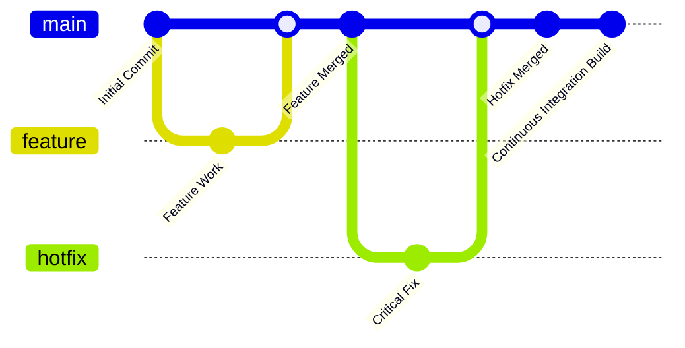

# 📝 Contribution Guidelines

Welcome to our codebase! To keep things smooth and **less chaotic than a merge conflict on a Friday afternoon**, please follow these contribution guidelines.

***

## 🔀 Branching Strategy

We follow **Trunk-Based Development**.

### **Trunk-Based Development Example:**

* **Main (**`main`**)** – Always production-ready. All changes merge directly here after review.

* **Feature Branches (**`feature/your-feature`**)** – Short-lived branches created from `main`, merged back ASAP.

* **Hotfixes (**`hotfix/critical-bug`**)** – Branch from `main` for urgent fixes, merge quickly.

* **Releases** – We tag releases from `main`, no separate release branches.



***

## ✅ Code Review Process

* **Who Approves PRs?** → At least **\[#]** approvals required before merging. No self-merges.

* **Review Style** → Keep it constructive, don’t just say *“LGTM”*, and **leave actionable feedback**.

* **The GIF Rule** → It’s an unwritten law that every PR **must** contain at least one GIF (or equivalent meme).

***

## 📌 PR Standards

A **good PR** should be:

* **Small & Focused** → Aim for **\[#] files max** per PR.

* **Descriptive** → PR title and description should **explain the *why* behind the change**, not just *“fixed stuff”*.

* **Linked to Issues/Tickets** → Reference relevant issues (e.g., `Closes #123`).

* **Clear Commits** → Use meaningful commit messages:

```shell
git commit -m "Fix user authentication bug (#123)"
```

***

## ⏳ PR SLAs

* **Time to Review** → PRs should be reviewed within **\[#] hours** of submission.

* **Merging PRs** → If a PR sits unreviewed for **\[#] days**, gently **@mention reviewers**.

* **No PR Left Behind** → Every PR gets reviewed. If yours is stuck, **poke the team (politely)**.

***

## 🔧 Linting, Formatting & CI/CD

* **Linting:** We use [ESLint](https://eslint.org/) – no failing lint checks in PRs.

* **Formatting:** Auto-format before committing. Use:

* **CI/CD Checks:** All PRs **must** pass automated tests before merging. No exceptions.

```shell
npm run format
