# 🚀 **Deployment Guide**

## **Environments**

| Environment | Description                                      | URL                     |
|------------|--------------------------------------------------|-------------------------|
| **Staging** | Pre-production testing environment.            | staging.example.com     |
| **Production** | Live environment.                           | production.example.com  |
| **Sandbox** | Rarely used, but available for experimentation. | sandbox.example.com     |

## **Deployment Steps (GitHub Actions)**

1. Push changes to the repository to trigger **GitHub Actions**.

2. The workflow runs tests, builds, and packages the application.

3. If tests pass, the deployment is pushed to **staging**.

4. After verification, an **approval step** is required for **production deployment**.

5. **Tag the release** before deploying to production.

```mermaid
graph LR;
    A[📌 Code Commit] -->|🚀 GitHub Actions Triggered| B[🛠️ Run Tests];
    B -->|📦 Build & Package| C[🚀 Deploy to Staging];
    C -->|✅ Verification| D[🏷️ Tag Release & Approve Deployment];
    D -->|🚀 Deploy to Production| E[🎉 Success];
    D -->|❌ Failure| F[🔄 Rollback];
```

## 🔄 **Rollback Plan**

* Identify the issue and confirm rollback necessity.

* Use **GitHub Actions rollback workflow** to revert to the previous stable release.

```mermaid
graph LR;
    A[🚨 Issue Detected] -->|🔍 Assess Impact| B[✅ Confirm Necessity];
    B -->|⚙️ Run Script| C[🔄 Trigger Rollback Workflow];
    C -->|🔬 Run Tests| D[✅ Validate Rollback];
    D -->|📝 Post-Mortem| E[📄 Document & Improve];
```

