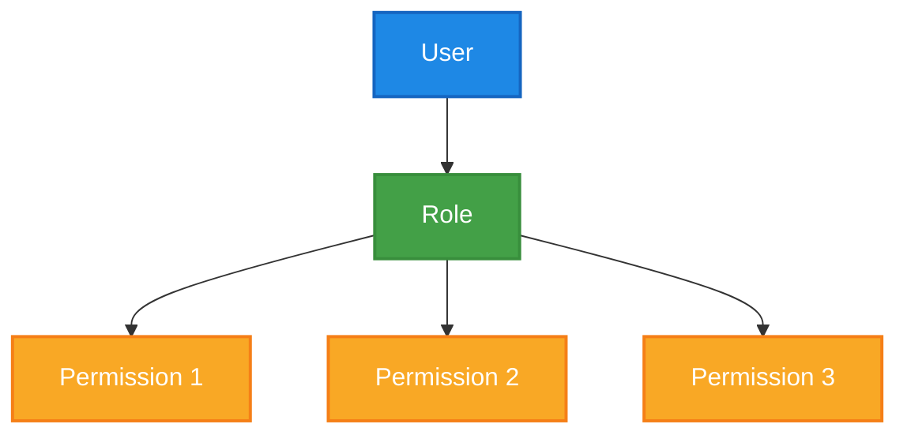

<!--  
📝 Usage:  
- Replace all {{placeholders}} with your organization's content
- Update links and remove unnecessary sections
- Customize as needed 

Happy documenting! 🚀  
-->

# 🛡️ Security Standards

This document outlines the security standards and best practices for {{ team-name }} to ensure the protection of our systems and data.

## 🎯 Core Principles

1. **Defense in Depth** - Multiple layers of security controls
2. **Least Privilege** - Minimal access required for job functions
3. **Secure by Design** - Security built into development process

## 🔒 Authentication & Authorization

### Authentication Standards

| Requirement | Standard | Implementation |
|-------------|----------|----------------|
| Password Complexity | {{ password-complexity }} | {{ password-implementation }} |
| MFA | {{ mfa-requirement }} | {{ mfa-implementation }} |
| Session Management | {{ session-requirement }} | {{ session-implementation }} |

### Authorization Model

## 🔐 Secure Coding Practices

### Input Validation

| Input Type | Validation Requirement | Example |
|------------|------------------------|---------|
| {{ input-type-1 }} | {{ validation-req-1 }} | {{ validation-example-1 }} |
| {{ input-type-2 }} | {{ validation-req-2 }} | {{ validation-example-2 }} |

### Output Encoding

| Context | Encoding Requirement | Example |
|---------|----------------------|---------|
| {{ context-1 }} | {{ encoding-req-1 }} | {{ encoding-example-1 }} |
| {{ context-2 }} | {{ encoding-req-2 }} | {{ encoding-example-2 }} |

## 🔍 Security Testing

| Test Type | Frequency | Tool | Owner |
|-----------|-----------|------|-------|
| SAST | {{ sast-frequency }} | {{ sast-tool }} | {{ sast-owner }} |
| DAST | {{ dast-frequency }} | {{ dast-tool }} | {{ dast-owner }} |
| Dependency Scanning | {{ deps-frequency }} | {{ deps-tool }} | {{ deps-owner }} |
| Penetration Testing | {{ pentest-frequency }} | {{ pentest-tool }} | {{ pentest-owner }} |

## 🚨 Security Incident Response

### Incident Severity Levels

| Level | Description | Response Time | Notification |
|-------|-------------|---------------|-------------|
| Critical | {{ critical-description }} | {{ critical-response-time }} | {{ critical-notification }} |
| High | {{ high-description }} | {{ high-response-time }} | {{ high-notification }} |
| Medium | {{ medium-description }} | {{ medium-response-time }} | {{ medium-notification }} |
| Low | {{ low-description }} | {{ low-response-time }} | {{ low-notification }} |

## 🔍 Related Documents

- [Incident Management Process](../standards/incident-management.md)
- [Deployment Security Checklist](../operations/deployment-checklist.md)
- [Data Protection Policy](../security/data-protection.md)

## 📚 Additional Resources

- [OWASP Top 10](https://owasp.org/www-project-top-ten/)
- [{{ company-name }} Security Handbook]({{ security-handbook-url }})
- [Security Training Resources]({{ security-training-url }})
