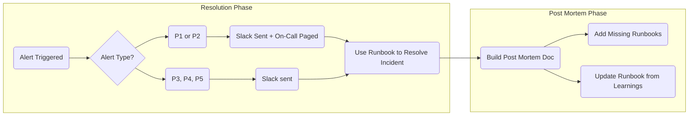

<!--  
�� Usage:  
- Replace all {{placeholders}} with your organization's content
- Update links and remove unnecessary sections
- Customize as needed 

Happy documenting! 🚀  
-->

# 🚨 Incident Management Standards

This document outlines the incident management process for {{ team-name }} to ensure consistent and effective incident response.

## 🎯 Key Objectives

- 🚀 **Minimize Downtime**: Quick and efficient incident resolution
- 🎉 **Improve Customer Satisfaction**: Clear communication and rapid response
- 🚍 **Maintain Business Continuity**: Robust incident handling procedures

## 🔄 Process Flow

## 🛠️ Tools & Technologies

| Tool | Description | Usage |
|------|-------------|-------|
| {{ incident-tool }} | {{ incident-tool-description }} | {{ incident-tool-usage }} |
| {{ monitoring-tool }} | {{ monitoring-tool-description }} | {{ monitoring-tool-usage }} |
| {{ logging-tool }} | {{ logging-tool-description }} | {{ logging-tool-usage }} |

## ⚠️ Alert Management

### Alert Severity Levels

| Level | Description | Response Time | Escalation Path |
|-------|-------------|---------------|-----------------|
| P1 | Critical - Service Down | < 15 minutes | {{ p1-escalation }} |
| P2 | Major - Service Degraded | < 30 minutes | {{ p2-escalation }} |
| P3 | Minor - Non-Critical | < 2 hours | {{ p3-escalation }} |
| P4 | Low - Informational | < 4 hours | {{ p4-escalation }} |

### Active Alerts

| Alert | Description | Runbook | Owner |
|-------|-------------|---------|-------|
| {{ alert-name }} | {{ alert-description }} | [View Runbook]({{ runbook-link }}) | {{ alert-owner }} |

> [!TIP]
> For teams using a single alerting system (e.g., DataDog), consider embedding runbooks directly in the alert configuration rather than maintaining this table.

## 📝 Post-Mortem Process

1. **Incident Summary**
   - Timeline of events
   - Impact assessment
   - Root cause analysis

2. **Action Items**
   - Immediate fixes
   - Long-term improvements
   - Documentation updates

3. **Documentation**
   - Update runbooks
   - Add new runbooks for gaps
   - Share learnings with team

## 🔍 Related Standards

- [On-Call Guidelines](./on-call.md)
- [Runbook Standards](./runbooks.md)
- [Communication Guidelines](./communication.md)

## 📚 Additional Resources

- [{{ team-name }} Incident Playbook](../playbooks/incident.md)
- [Architecture Overview](../architecture/overview.md)
- [Service Dependencies](../architecture/dependencies.md)
