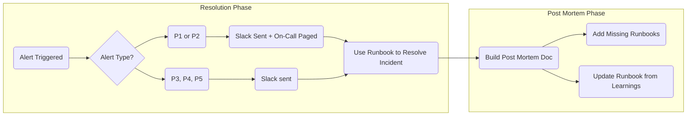

<!--  
📝 Usage:  
- Replace any {{placeholders}} with your own content
- Update links and remove unnecessary sections
- Customize as needed 

Happy documenting! 🚀  
-->

# 🚨 Incident Management

A structured incident management process is crucial to:

* 🚀 **Minimize Downtime**

* 🎉 **Improve Customer Satisfaction**

* 🚍 **Maintain Business Continuity**

It also enhances team collaboration, ensures compliance, builds stakeholder trust, and strengthens system reliability.

## Incident Management Process

## Tools

We use the following tools and technologies to support our incident management process.

| Tool         | Description                                                                 |
|-------------|-----------------------------------------------------------------------------|
| Incident.io | Describe in 2-3 sentences what the platform is and what you use it for.      |
| Checkly     | Describe in 2-3 sentences what the platform is and what you use it for.      |
| DataDog     | Describe in 2-3 sentences what the platform is and what you use it for.      |
|             |                                                                             |

## Alerts

Below is a table of our alerts and the corresponding runbooks.

> \[!TIP]
>
> If you are only using a single system for defining alerts, it may be overkill to build this table. We would recommend you embed the runbooks directly in that system, next to the alert. For example, if you use DataDog, embed the URL for the runbook next to the alert in DataDog.

| Alert              | Description                                  | Runbook            |
|--------------------|----------------------------------------------|--------------------|
| Example Alert #1   | Describe the alert in 1 to 2 sentences       | Link to Runbook    |
| Example Alert #1   | Describe the alert in 1 to 2 sentences       | Link to Runbook    |
| Example Alert #1   | Describe the alert in 1 to 2 sentences       | Link to Runbook    |
|                    |                                              |                    |
