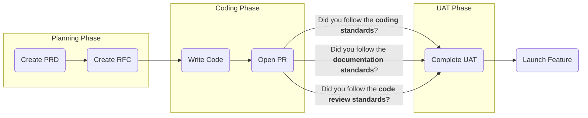

<!--  
📝 Usage:  
- Replace any {{placeholders}} with your own content
- Update links and remove unnecessary sections
- Customize as needed 

Happy documenting! 🚀  
-->

# ⚙️ Software Development

Below is our software development process.

## Phases
| Phase                   | Description                                                                                                                       | Definition of Done                                                                                                                                                                                                     |
|-------------------------|-----------------------------------------------------------------------------------------------------------------------------------|------------------------------------------------------------------------------------------------------------------------------------------------------------------------------------------------------------------------|
| 📋 Requirements            | During this stage, we review the PRD as an engineering team and get all of our questions answered before we start development.   | All engineers **MUST** sign off on the PRD by approving the pull request.                                                                                                                                               |
| 🎨 Technical Discovery     | Before starting development, we complete an RFC to scope out the work for the PRD.                                               | - All engineers **MUST** sign off on the approach outlined in the RFC by approving the pull request. - The Engineering Team **MUST** be able to tell the Product Team how long the feature will take. - The Engineering Team and Product Team **MUST** agree to any increase or decrease in scope that came from the RFC learnings. - All changes to requirements that come from the RFC learnings **MUST** be updated in the PRD. |
| 💻 Write & Review Code     | We write the code for the features we agreed upon in the PRD and open a Pull Request to get the other engineers’ feedback. All testing at this stage is done via a preview environment. | - The engineering team **MUST** write the code for the feature, following all **Code Style Standards**. - The engineering team **MUST** sign off on the Pull Request and follow all **Code Review Standards**. - The engineering team **MUST** document the feature(s), following all **Documentation Standards**.                      |
| 🧪 User Acceptance Testing ("UAT") | The product manager who wrote the PRD tests the feature to ensure the engineering team completed all of the requirements. | - The Engineering Team **MUST** deploy the feature to staging, so the Product Manager can complete UAT. - The Product Manager **MUST** sign off that the feature is ready to deploy to production.                                                      |
| 🚀 Launch Feature          | The engineering team deploys the feature to production, does a quick smoke test, and the product manager announces the feature to our users. | - The Engineering Team **MUST** deploy the feature to production, complete a quick smoke test, and **MUST** let the Product Team know when this is complete. - The Product Team **MUST** announce this feature to the users.                           |
