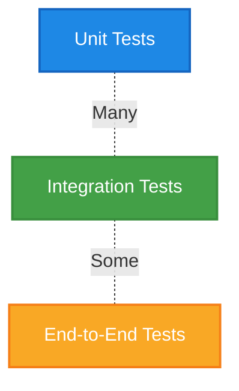

<!--  
📝 Usage:  
- Replace all {{placeholders}} with your organization's content
- Update links and remove unnecessary sections
- Customize as needed 

Happy documenting! 🚀  
-->

# 🧪 Testing Strategy

This document outlines the testing strategy for the {{ project-name }} project, covering test types, tools, and best practices.

## 🎯 Testing Pyramid



## 📊 Test Coverage Goals

| Test Type | Target Coverage | Tools | Owner |
|-----------|----------------|-------|-------|
| Unit Tests | {{ unit-test-coverage }} | {{ unit-test-tools }} | {{ unit-test-owner }} |
| Integration Tests | {{ int-test-coverage }} | {{ int-test-tools }} | {{ int-test-owner }} |
| E2E Tests | {{ e2e-test-coverage }} | {{ e2e-test-tools }} | {{ e2e-test-owner }} |

## 🔎 Test Types & Scope

### Unit Tests

- **Scope**: {{ unit-test-scope }}
- **When to Write**: {{ unit-test-when }}
- **Examples**:
  - {{ unit-test-example-1 }}
  - {{ unit-test-example-2 }}

### Integration Tests

- **Scope**: {{ int-test-scope }}
- **When to Write**: {{ int-test-when }}
- **Examples**:
  - {{ int-test-example-1 }}
  - {{ int-test-example-2 }}

### End-to-End Tests

- **Scope**: {{ e2e-test-scope }}
- **When to Write**: {{ e2e-test-when }}
- **Examples**:
  - {{ e2e-test-example-1 }}
  - {{ e2e-test-example-2 }}

## 🧮 Test Data Management

| Data Type | Management Strategy | Tools |
|-----------|---------------------|-------|
| Mock Data | {{ mock-data-strategy }} | {{ mock-data-tools }} |
| Fixtures | {{ fixtures-strategy }} | {{ fixtures-tools }} |
| Test Database | {{ test-db-strategy }} | {{ test-db-tools }} |

## 🚀 Running Tests

### Locally

```bash
# Run all tests
{{ run-all-tests-command }}

# Run unit tests only
{{ run-unit-tests-command }}

# Run integration tests only
{{ run-int-tests-command }}

# Run E2E tests only
{{ run-e2e-tests-command }}
```

### In CI/CD

```yaml
# Example CI/CD configuration snippet
{{ ci-test-config }}
```

## 🔍 Related Documents

- [Code Style Standards](../standards/code-style.md)
- [CI/CD Pipeline](../operations/ci-cd.md)
- [Development Workflow](../standards/software-development.md)

## 📚 Additional Resources

- [{{ test-framework-1 }} Documentation]({{ test-framework-1-docs }})
- [{{ test-framework-2 }} Documentation]({{ test-framework-2-docs }})
- [Testing Best Practices]({{ testing-best-practices }})
